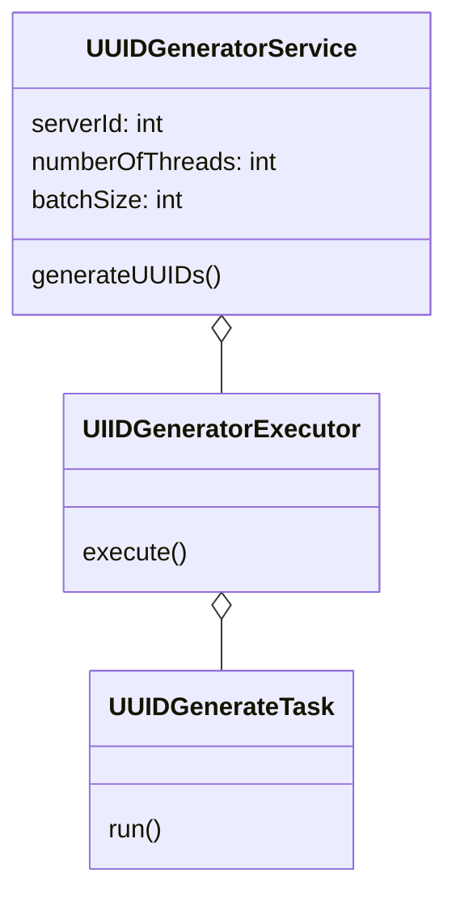

# LLD and machine coding for UUID genrator
### Requirements
* Design a system that is incrementally scallable upto 1000 unique ID requests per second each by 1000 devices per person, for every human on the earth for 100 years.
* Consider:
```text
10^10 - number of people on the planet
10^10 - number of second in 100 years
10^7 - max requests per second per server serviceable.
```
### Computation
```text
So total number of Request = 
10^10(person) x 10^10(seconds) x 10^3(device/person) x 10^3(request/device/second)
= 10^26

Request per server = 10^26 / 10^7 = 10^19 ~= 2^63 == 2^64
So we need 64-bit of ID in each server.

Fist 40 bit -- timestamp in ms
next 8 bits -- ServerId
next 4 bits -- threadId
next 12 bits -- local counter
```
### Entities
* UUIDGeneratorService
* UIIDGeneratorExecutor
* UUIDGenerateTask

### Entity-Relationships


There are multiple servers running as per the load, `Zookeeper` will mange the server.


