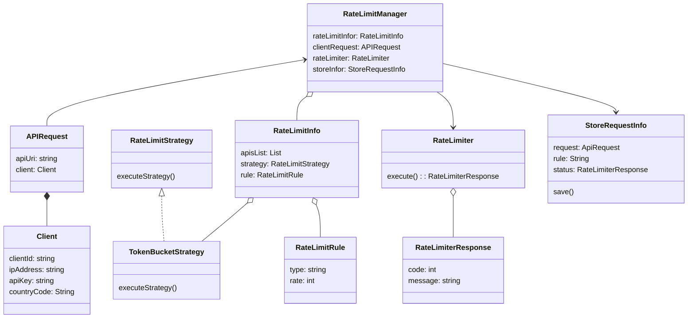

# LLD For API Rate Limiter
### Requirements
* User able to add list of APIs to rate limit. By default, it limits any incoming APIs.
* user able to add rate limit strategy
* User Able to provide allowed rate per/s
* User Able to add rules on the requester information(clientId, API key, IP address, CountryCode)
* System sends response (show error page with correct error message and code)
* Store information - who crossed rates, what is the rate information

### Entities
* Client
* API Request
* RateLimitManager
* RateLimitInfo
* RateLimitStrategy
* RateLimitRule
* RateLimiter
* RateLimiterResponse
* StoreRequestInfo

### Entities-Relationships

### Identify Design Pattern from Entities-Relationships
* **Strategy Pattern:-** This pattern allows the `RateLimitManager` to use different rate-limiting strategies interchangeably.
* **Repository Pattern:-** This pattern used to create `Dao` for the DB related operations. 
### DB Schema
#### RateLimiter table

```json
{
  "id" : "12345",
  "api":  "http://URI",
  "client": {
    "clientId" : "clientId1",
    "IpAddress" : "xxxx.xxxx.xxxx.xxxx",
    "Apikey":  "ff123kl#1",
    "CountryCode" : "UK"
  },
  "rate" : "80",
  "status" : "STOPPED",
  "timestamp": "time"
}
```

### Interface-level Coding
