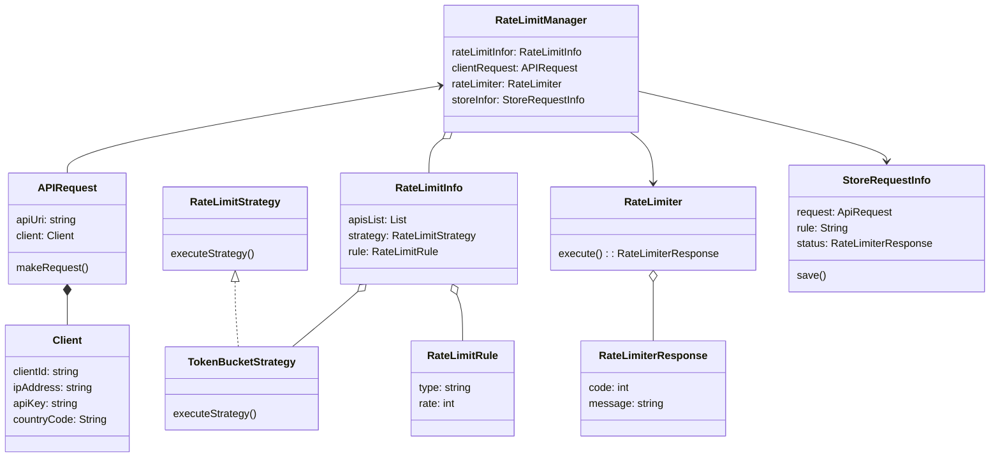

# LLD For API Rate Limiter
### Requirements
* User able to add list of APIs to rate limit. By default, it limits any incoming APIs.
* user able to add rate limit strategy
* User Able to provide allowed rate per/s
* User Able to add rules on the requester information(clientId, API key, IP address, CountryCode)
* System sends response (show error page with correct error message and code)
* Store information - who crossed rates, what is the rate information

### Entities
* Client:
* API Request
* RateLimitManager
* RateLimitInfo
* RateLimitStrategy
* RateLimitRule
* RateLimiter
* RateLimiterResponse
* StoreRequestInfo

### Entities-Relationships

### Identify Design Pattern from Entities-Relationships
### DB Schema 
### Interface-level Coding
