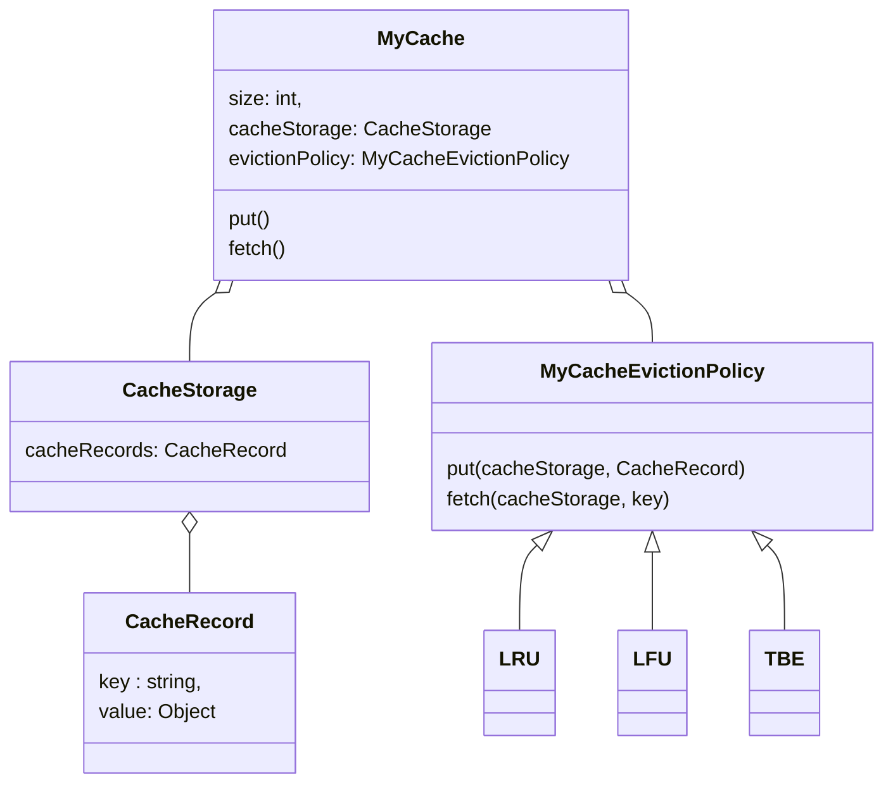

# LLD For Custom Cache 
### Requirements
* The Cache module should be generic, re-usable and easy to integrate across various modules within your production/organization.
* The cache will be bounded by a fixed capacity (number of items) for holding the objects, which will be mentioned during early initialization of the p program.
* Upon hitting the capacity, the cache module can invoke one of various cache eviction strategies to make room for newer objects. You are required to incorporate cache eviction in your code to handle aforementioned condition.
* You could choose to implement various cache eviction strategies such as 'Least recently used', 'Least frequently used', 'time based expiration'et.al

### Entities
* MyCache
* CacheStorage
* CacheRecord
* MyCacheEvictionPolicy
* LRU
* LFU
* TBE
### Entity-Relationships

### Identify Design Pattern from Entities-Relationships
* **Strategy Pattern:** The strategy pattern is used for the different eviction policies.
### Interface-level Coding