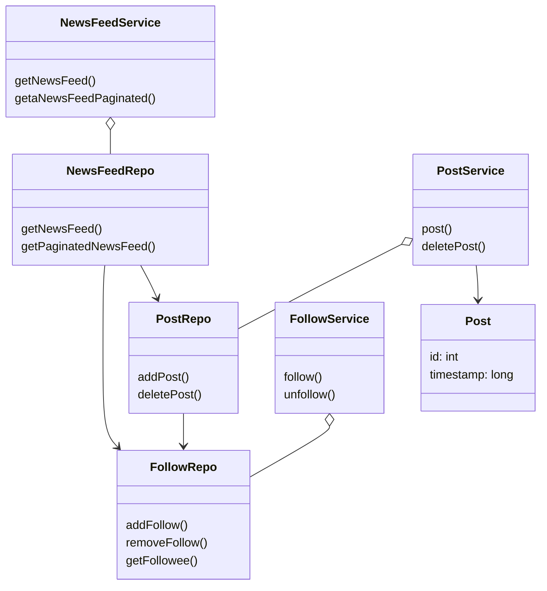

# LLD for Facebook SubSystem
### Requirements 
Design Facebook (LLD) :
Implement the below APIs
* public void post(int userId, int postId);
* public void follow(int followerId, int followeeId);
* public void unfollow(int followerId, int followeeId);
* public List<Integer> getNewsFeed(int userId);
* public List<Integer> getNewsFeedPaginated(Integer userId, Integer pageNumber);
* public void deletePost(int postId);

### Entities
* Post
* FollowRepo
* NewsFeedRepo
* PostRepo
* FollowService
* NewsFeedService
* PostService

### Entity-Relationships
