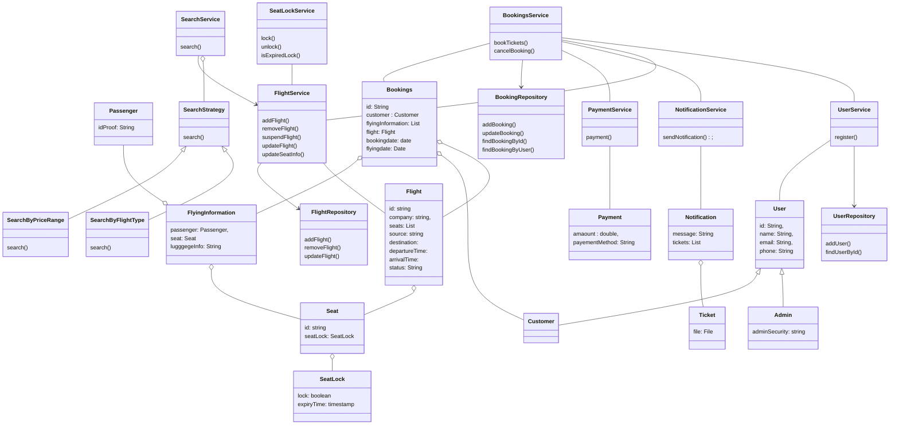

# LLD For Flight Booking System 
### Requirements
* user able to register  
* Admin can add new Flight
* Admin can remove Flight
* User can search flights - by source - destination and flight Date
* System shows available flights with available seats
* User select the flights by can be onway or round trip
* user add passengers 
* User select seats on available seats
* User make payment
* System sends notification with tickets to user.
### Entities
* User - Customer, Admin
* Flight
* Seat
* SeatLock
* SeatLockService
* UserService
* FlightService
* FlightRepository
* UserRepository
* SearchService
* SearchRequest
* SearchStrategy - PriceBase, 
* SearchResponse
* Bookings
* BookingService
* BookingRepository
* Passenger
* PaymentService
* Payment
* NotificationService
* Notification
* Ticket
### Entity-Relationships

### Identify Design Pattern from Entities-Relationships
* Strategy Pattern
* Repository pattern
* Facade Pattern
