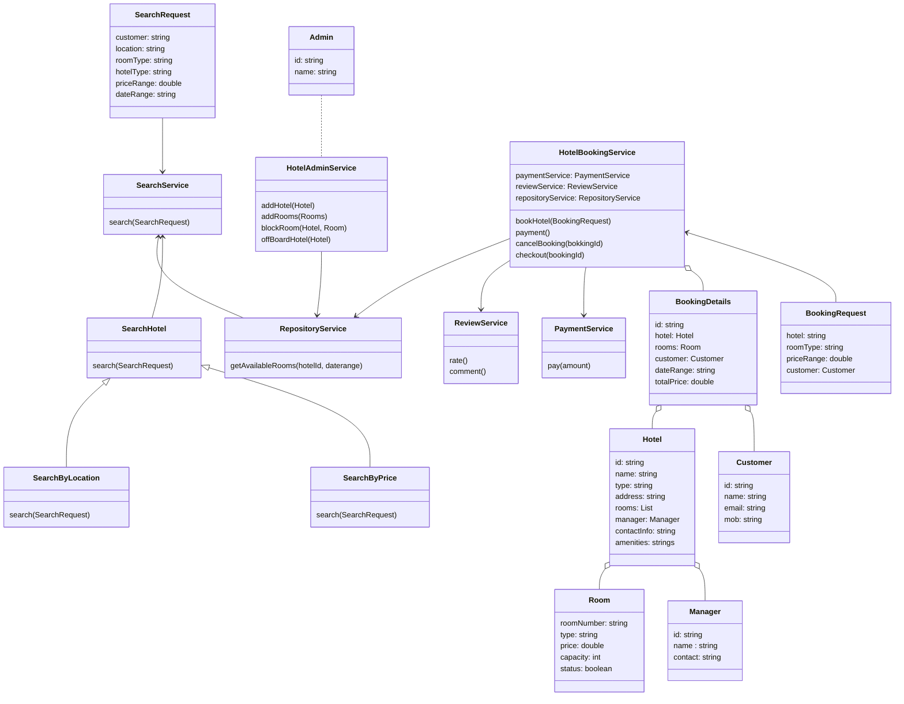

# LLD For Hotel Booking System
### Requirements
* Admin will be able to add new hotel
* Admin will be able to add new hotel rooms
* Admin will be able to remove hotel from the system
* Admin will be able to block rooms
* Customer will be able to search for hotels based on location, hotel type, room type and price
* Customer will be able to book available rooms
* Customer can do online Payments on booking.
* Customer will be able to cancel bookings
* Customer will be able to check out
* Customer can see booking history
* Customer can provide review and ratings
### Entities
* Admin
* Hotel
* Room
* HotelAdminService
* Customer
* SearchRequest
* SearchService
* BookingRequest
* BookingDetails
* HotelBookingService
* PaymentService
* ReviewRatingService
### Entity-Relationships

### Identify Design Pattern from Entities-Relationships
* **Factory Method Pattern:** The `Hotel` and `Room` classes can have multiple types, and they are created when the addRoom and addHotel methods are called. The factory method cn be use for creating instances of these classes.
* **Strategy Pattern:** The search for hotels can be by different type of parameters like Hotel location, Hotel Type, Room Type, Room Capacity or Price range. We can use Strategy pattern for different search strategy used in Search service.
* **Facade Pattern:** The `HotelBookingService` follows the Facade pattern, where it provides a unified interface to interact with different subsystems or interfaces within the hotel booking system
* **Singleton Pattern:** All the service class can be Singleton.
* **Repository Pattern:** The `RepositoryService` interacts with storage system which follows repository pattern. 
### DB Schema
#### HotelInfo table
```json
{
  "id" : "h1",
  "location": "l1",
  "name" : "string",
  "type" : "s star",
  "rooms": ["r1", "r2"],
  "manager": "m1",
  "contact" : "contactInfo",
  "amenities": ["a1", "a2"]
}
```
#### RoomInfo table
```json
{
  "id" : "r1",
  "type": "ty1",
  "capacity" : 3,
  "price" : 1111.00,
  "status": "active"
}
```
#### Bookings Table
```json
{
  "id": "b1",
  "hotelId": "h1",
  "roomIds" : ["r1", "r2"],
  "startDate": "date1",
  "endDate": "date2",
  "totalPrice" : 23445.00,
  "customerId": "custId",
  "guestIds": ["g1", "g2"]
}
```

### Interface-level Coding