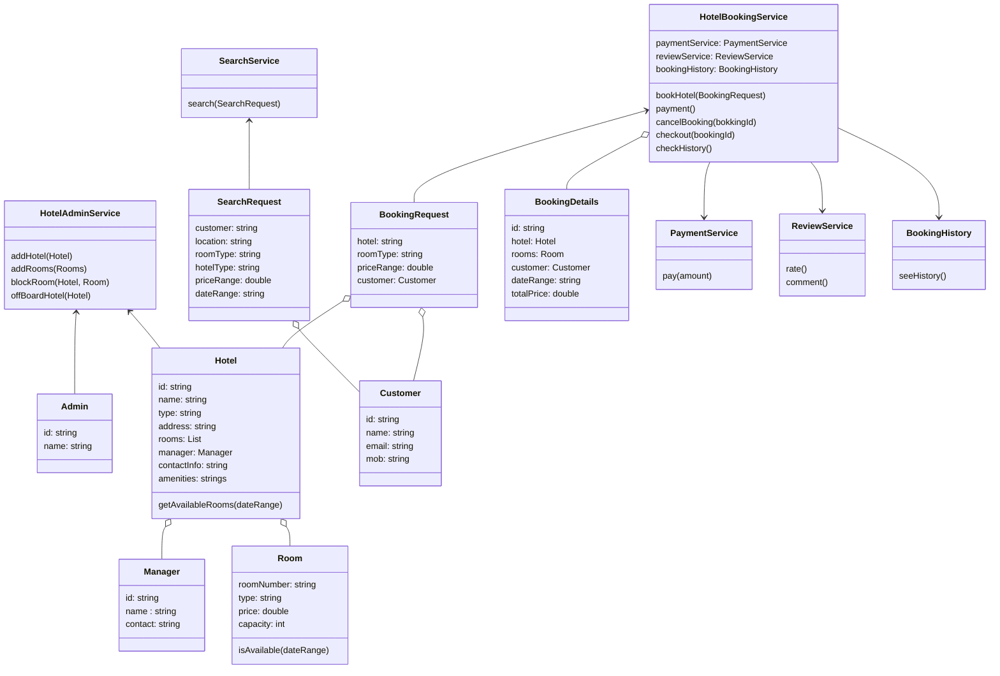

# LLD For Hotel Booking System
### Requirements
* Admin will be able to add new hotel
* Admin will be able to add new hotel rooms
* Admin will be able to remove hotel from the system
* Admin will be able to block rooms
* Customer will be able to search for hotels based on location, hotel type, room type and price
* Customer will be able to book available rooms
* Customer can do online Payments on booking.
* Customer will be able to cancel bookings
* Customer will be able to check out
* Customer can see booking history
* Customer can provide review and ratings
### Entities
* Admin
* Hotel
* Room
* HotelAdminService
* Customer
* SearchRequest
* SearchService
* BookingRequest
* BookingDetails
* HotelBookingService
* PaymentService
* ReviewRatingService
### Entity-Relationships

### Identify Design Pattern from Entities-Relationships
### DB Schema
### Interface-level Coding