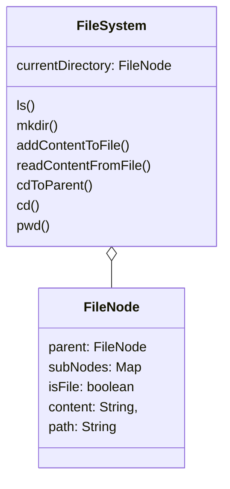

# In memory file system
### Requirements
* File system has root as "/"
* `ls` should return the files and directory in the path
* `mkdir` will crate and empty directory
* `addContentToFile` adds content to file
* `readContentFromFile` reads contents from the file
* `cdToParent` will show parent directory
* `cd` will go to subdirectory
* `pwd` will show current directory

### Entities
* FileSystem
* FileNode

###

