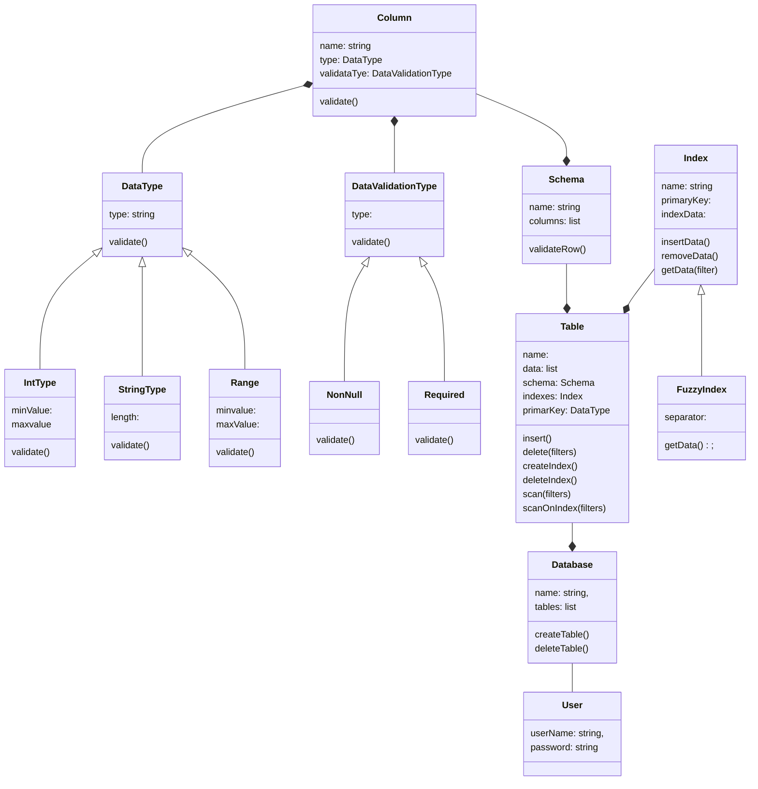

# LLD For In Memory DB 
### Requirements
* The user should be able to define columns using the name and data type and can also specify custom validations on them such as the value cannot be null for string column type, the value should be in provided range for integer column type, column value can be required or not, etc.
* The user should be able to create tables using a defined schema, where the schema is a collection of columns with certain validations.
* The user should be able to insert/update/delete data in a table. Any errors during schema validations are to be raised to the user.
* The user should be able to query data using multiple filters on any of the columns.
* The user can create additional indexes on any columns and of any type like reverse, fuzzy, etc and the same should be used for querying.
* In one query, multiple filter criteria can be sent and data needs to be filtered accordingly.
### Entities
* User
* DataBase
* Column
* DataType
* DataValidationType
* Table
* Schema
* Index
### Entity-Relationships

### Identify Design Pattern from Entities-Relationships

