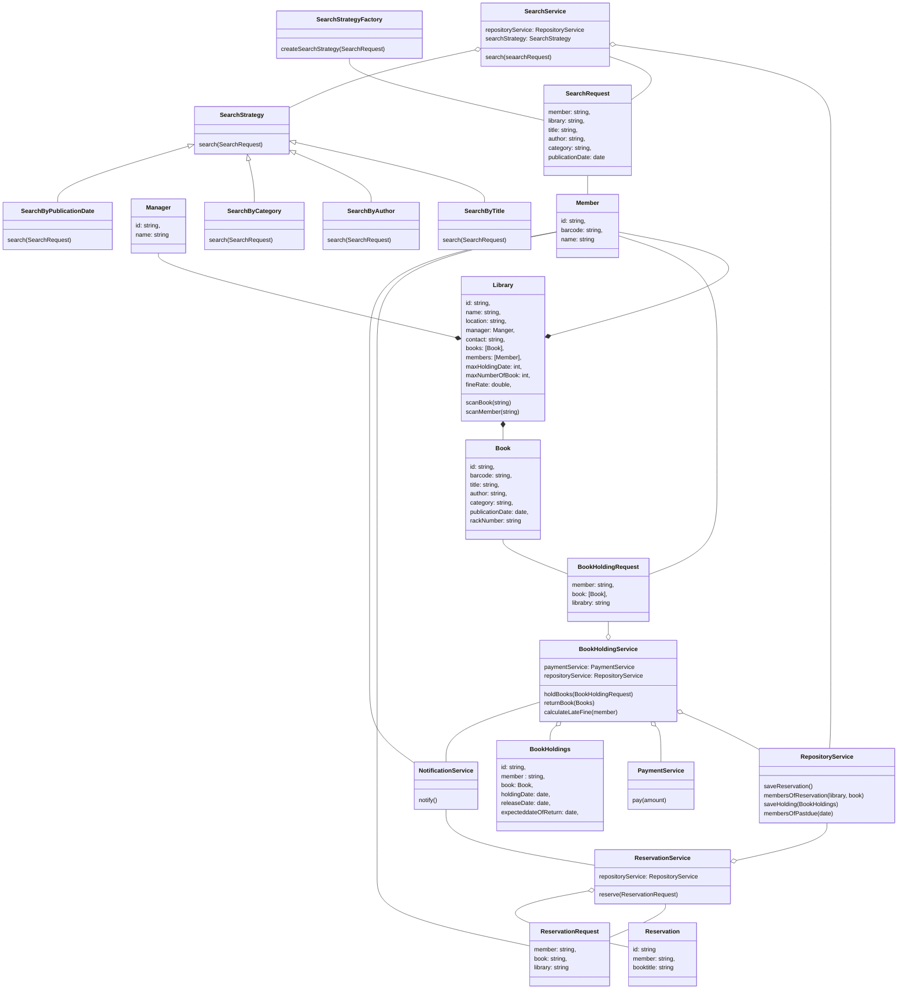

# Library Management System
## Question: 
Design a library management system where-
* Any library member should be able to search books by their title, author, subject category as well by the publication date.
* Each book will have a unique identification number and other details including a rack number which will help to physically locate the book.
* There could be more than one copy of a book, and library members should be able to check-out and reserve any copy. We will call each copy of a book, a book item.
* The system should be able to retrieve information like who took a particular book or what are the books checked-out by a specific library member.
* There should be a maximum limit (5) on how many books a member can check-out.
* There should be a maximum limit (10) on how many days a member can keep a book.
* The system should be able to collect fines for books returned after the due date.
* Members should be able to reserve books that are not currently available.
* The system should be able to send notifications whenever the reserved books become available, as well as when the book is not returned within the due date.
* Each book and member card will have a unique barcode. The system will be able to read barcodes from books and members’ library cards.

### Functional Requirements
* Member will be able to search book by its title, author, subject category as well by the publication date. 
* Member will be able to request one or more books (max of 5 including pre holdings)
* Member will be able to reserve books if the books are not present.
* The System will be able to check the information like who took a particular book or what are the books checked-out by a specific library member 
* The System will be able to send notification for overdue or reserved book arrival.
* The system will be able to collect late fine.
* The System can scan barcode of book and member id

### Entities(Needed Classes)
* Member
* Book
* Library
* Manager
* SearchRequest
* SearchService
* SearchStrategy
* SearchStrategyFactory
* BookHoldingService
* BookHoldings
* BookHoldingRequest
* PaymentService
* ReservationService
* Reservation
* ReservationRequest
* NotificationService
* RepositoryService

### Entities-Relationships

### Identify Design Pattern from Entities-Relationships
* **Factory Method Pattern:** The instance for different search Strategy are created using factory patter. 
* **Strategy Pattern:** The search for books can be by different type of parameters. We can use Strategy pattern for different search strategy used in Search service.
* **Facade Pattern:** The `BookHoldingService` follows the Facade pattern, where it provides a unified interface to interact with different subsystems or interfaces the system.
* **Singleton Pattern:** All the service class can be Singleton.
* **Repository Pattern:** The `RepositoryService` interacts with storage system which follows repository pattern. 

### Interface-level Coding
[library-management-system/src]()
