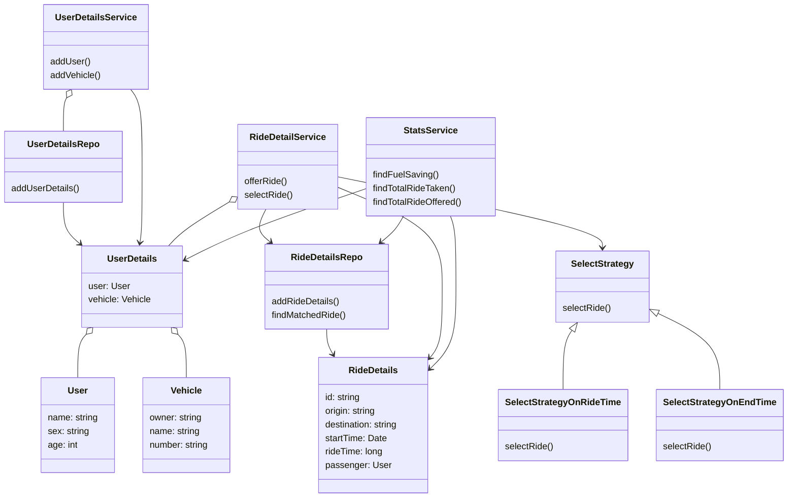

# LLD for a Ride Sharing System
### Requirements
* Given in the image [f1.png](f1.png) and [f2.png](f2.png)

### Entities
* User
* Vehicle
* UserDetails
* RideDetails
* UserDetailsRepo
* RideDetailsRepo
* UserDetailsService
* RideDetailService
* StatsService
* SelectStrategy
* SelectStrategyOnRideTime
* SelectStrategyOnEndTime

### Entity-Relationships

