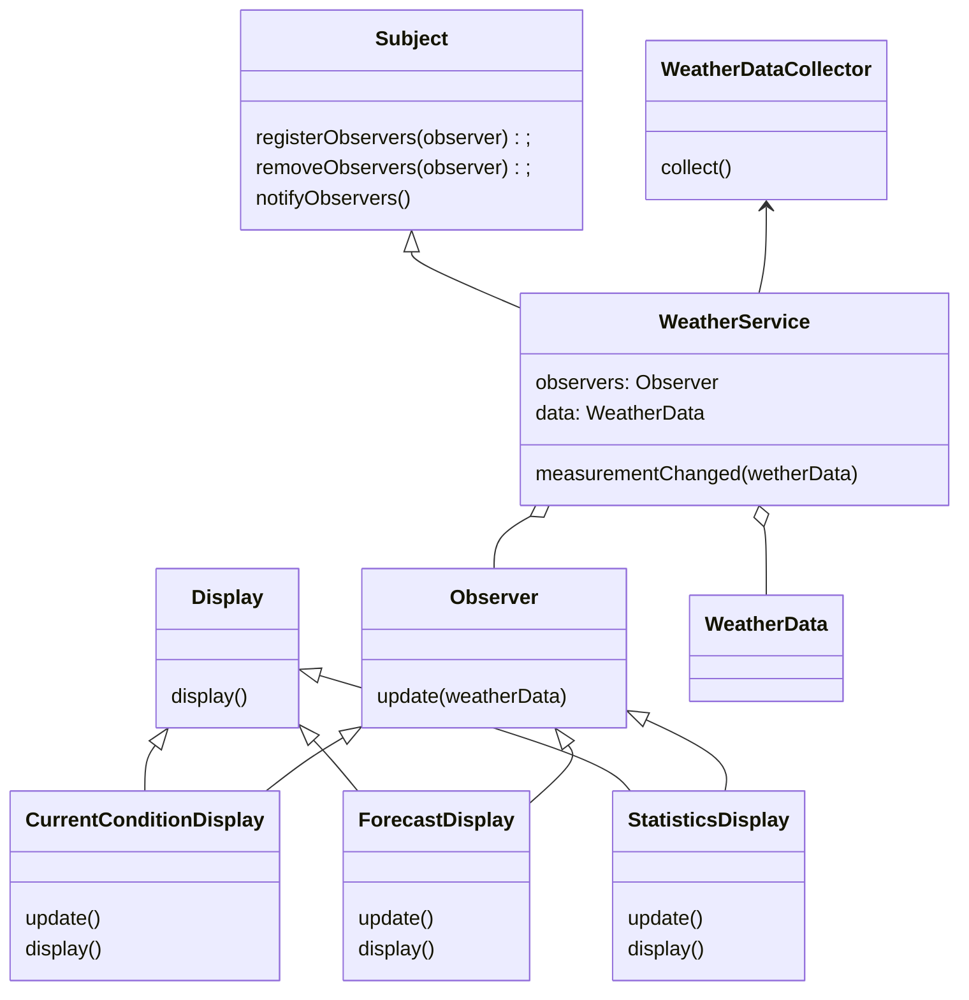

# LLD For A Weather Service
### Requirements
* Able to Pulls Weather data from an API.
* Multiple clients sees the data in their display systems
* The Service should be scalable
### Entities
* WeatherService
* Observer
* WeatherDataCollector
* WeatherData
* Subject
* CurrentConditionDisplay
* ForecastDisplay
* StatisticsDisplay
### Entity-Relationships

### Identify Design Pattern from Entities-Relationships
* **Observer pattern:** The weather service data collects from collector and all the observers get the update.
### Machine Coding

